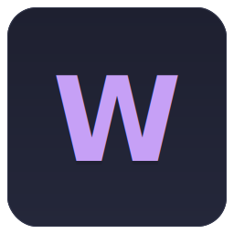

<h3 align="center">
   
</h3>

  
  
  

  

- [🪴 Overview](#-overview)
- [👐 Contributions](#-contributions)
  - [🪵 Naming Convention](#-naming-convention)
  - [🌙 Content Requirements](#-content-requirements)

## 🪴 Overview

A curated collection of high-quality wallpapers, organized by tags for easy browsing and downloading. Perfect for desktops, laptops and phones.

✨ **Browse & Download** wallpapers using the web app: [pivoshenko.wallpapers](https://pivoshenko-wallpapers.netlify.app)

## 👐 Contributions

To maintain quality and consistency, please follow these rules when adding wallpapers. Place all wallpapers in the `./app/static/wallpapers` directory. No subdirectories are needed.

### 🪵 Naming Convention

All wallpapers must follow this format:

`<name>_<tag_0>_<tag_1>_<tag_2>.png`

- Wallpaper name: lowercase letters only, words separated by `-`. No spaces or special characters
- Tags: lowercase letters only, separated by `_`
- GIFs: must include the `animated` tag
- Accepted formats: PNG, GIF only

### 🌙 Content Requirements

- High-quality images only (avoid blurry, pixelated, or low-resolution wallpapers; minimum resolution: 1920x1080 recommended)
- **No NSFW** or offensive content
